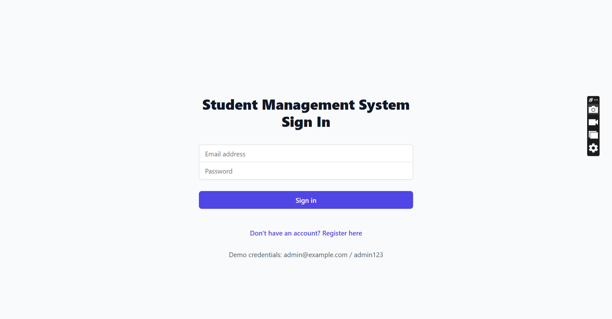
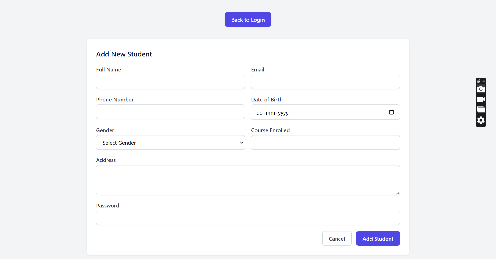
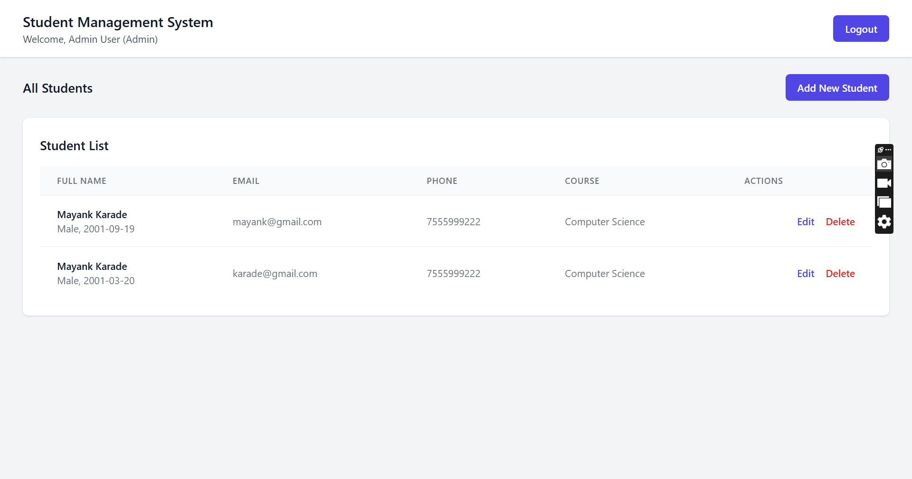

Student Management System
A React TypeScript application for managing student records with login functionality, registration, and CRUD operations.

Features
. User Authentication: Login system for admin and students
. Student Registration: Form to register new students
. CRUD Operations: Create, Read, Update, and Delete student records
. Data Encryption: AES encryption for sensitive data
. Responsive Design: Built with Tailwind CSS

Screenshots

1. Login Page
   
2. Registration Form
   
3. Student List
   

Tech Stack
. Frontend: React 19 + TypeScript
. Build Tool: Vite
. Styling: Tailwind CSS
. Database: JSON Server
. Encryption: CryptoJS for AES encryption
. Routing: React Router DOM

Prerequisites
. Node.js (version 14 or higher)
. npm or yarn

Setup Instructions

1. Clone or download the project and navigate to the project directory.

2. Install dependencies:
   npm install
3. Create the database file (db.json) in the root directory with the following content:
   {
   "students": []
   }
4. Start the JSON Server (runs on port 3001):
   npm run server
5. In a new terminal, start the development server:
   npm run dev
6. Open your browser and navigate to http://localhost:5173

Login Credentials
Admin Access
Email: admin@example.com
Password: admin123

Student Access
. Click "Register here" on the login page
. Fill out the registration form
. Use your registered email and password to login

Encryption Implementation
The application uses AES encryption from the CryptoJS library to encrypt student passwords before storing them in the database.

How it works:

1. When a student is created or updated, the password is encrypted using the encryptData function

2. The encrypted password is stored in the database

3. During login, the stored password is decrypted and compared with the input

Encryption functions in src/utils/crypto.ts:
// Encrypt data
export const encryptData = (data: string): string => {
return CryptoJS.AES.encrypt(data, SECRET_KEY).toString();
};

// Decrypt data
export const decryptData = (cipherText: string): string => {
const bytes = CryptoJS.AES.decrypt(cipherText, SECRET_KEY);
return bytes.toString(CryptoJS.enc.Utf8);
};

Project Structure
src/
components/ # React components
LoginForm.tsx # Login form component
StudentForm.tsx # Student registration/edit form
StudentList.tsx # Student list display
utils/ # Utility functions
crypto.ts # Encryption/decryption functions
types/ # TypeScript type definitions
index.ts # Interface definitions
App.tsx # Main application component
main.tsx # Application entry point
index.css # Global styles with Tailwind CSS
db.json # JSON database file

Available Scripts
. npm run dev - Start the development server
. npm run server - Start the JSON server
. npm run dev:full - Start both servers concurrently
. npm run build - Build for production
. npm run preview - Preview the production build
. npm run lint - Run ESLint

Notes
. This is a demonstration application with a simplified authentication system
. In a production environment, you should use proper password hashing instead of encryption
. The secret key for encryption should be stored in environment variables in a real application
. JSON Server provides a mock REST API for development purposes

Troubleshooting

1. "Missing script: server" error: Make sure your package.json includes the server script:
   "scripts": {
   "server": "json-server --watch db.json --port 3001"
   }
2. Port already in use: Change the port in the server script or kill the process using the port
3. JSON Server not found: Install json-server globally or as a dev dependency:
   npm install -g json-server
   # or
   npm install --save-dev json-server

Development
To add new features or modify the application:

1. Components are located in src/components/
2. Type definitions are in src/types/index.ts
3. Utility functions are in src/utils/
4. Styles are implemented using Tailwind CSS classes

License
This project is for educational/demonstration purposes.
